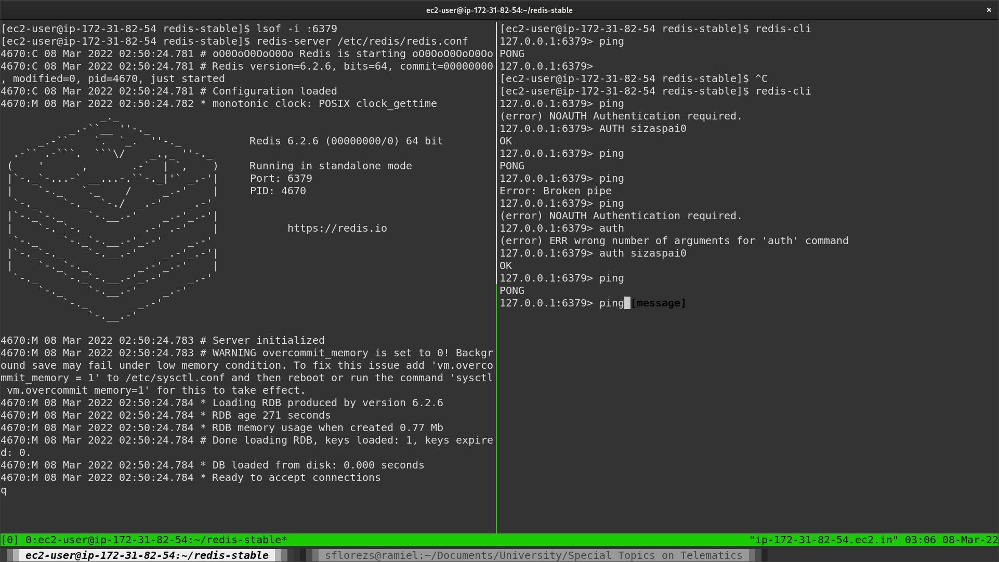
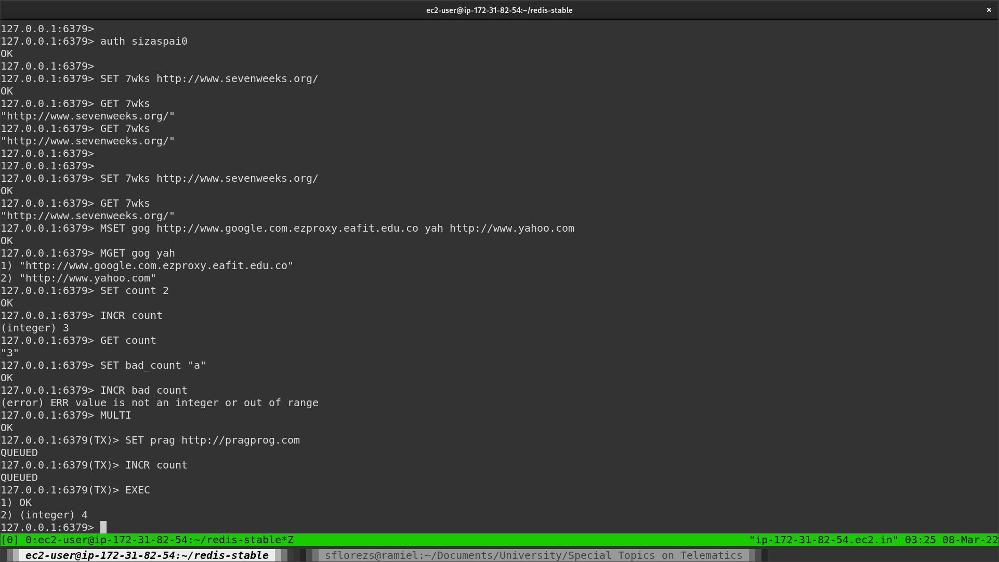
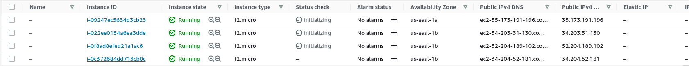
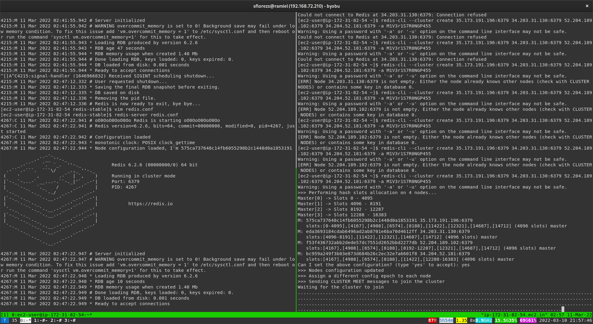

## Open a terminal
```bash
# install a c compiler
sudo yum install -y gcc
# Download and install redis
wget http://download.redis.io/redis-stable.tar.gz
tar xvzf redis-stable.tar.gz
cd redis-stable
make distclean
make
# install globally
sudo make install
# create a backup for the config file
cp redis.conf{,.bk}
# setup a password for auth
sed 's/# requirepass foobard/requirepass M1V3r1S7R0NGP455/g' redis.conf
# run the redis server with the config, make sure to open another terminal since this command will lock the terminal until the server is terminated
redis-server redis.conf
```

## On other terminal
```bash
# test the connection
redis-cli
127.0.0.1:6379> ping
# (error) NOAUTH Authentication required.
127.0.0.1:6379> auth M1V3r1S7R0NGP455
# OK
127.0.0.1:6379> ping
# PONG
```



## Redis examples from Seven Databases in Seven Weeks

```bash
redis-cli
127.0.0.1:6379> AUTH M1V3r1S7R0NGP455
OK
127.0.0.1:6379> SET 7wks http://www.sevenweeks.org/
OK
127.0.0.1:6379> GET 7wks
"http://www.sevenweeks.org/"
127.0.0.1:6379> MSET gog http://www.google.com.ezproxy.eafit.edu.co yah http://www.yahoo.com
OK
127.0.0.1:6379> MGET gog yah
1) "http://www.google.com.ezproxy.eafit.edu.co"
2) "http://www.yahoo.com"127.0.0.1:6379> SET count 2
OK
127.0.0.1:6379> INCR count
(integer) 3
127.0.0.1:6379> GET count"3"
127.0.0.1:6379> SET bad_count "a"
OK
127.0.0.1:6379> INCR bad_count(error) ERR value is not an integer or out of range
127.0.0.1:6379> MULTI
OK
127.0.0.1:6379(TX)> SET prag http://pragprog.comQUEUED
127.0.0.1:6379(TX)> INCR count
QUEUED
127.0.0.1:6379(TX)> EXEC
1) OK
2) (integer) 4
```


## Unbind redis from loopback
By default redis is bound to the loopback interface, if we want to access redis from outside we need to comment the specific line in the config.

```bash
sed 's/bind 127.0.0.1 -::1/# bind 127.0.0.1 -::1/g' redis.conf
```

## Python examples

You can find some examples in this directory for a simple cli program implementing the CRUD operations.

The basic usage of the programs:
```bash
usage: redis_<operation> [-h] [-H HOST] [-p PORT] [-k KEY] [-v VALUE]

Example python application to test the create operation in redis.

options:
  -h, --help            show this help message and exit
  -H HOST, --host HOST  IP of the host to connect to.
  -p PORT, --port PORT  Port in which the redis server is listening in the host.
  -k KEY, --key KEY     Key of the value.
  -v VALUE, --value VALUE Value.
```

```bash
# redis_create.py
> python redis_create.py -H 184.73.121.22 -p 6379 -k password -v M1V3r1S7R0NGP455
> Password:
Setting "password" to "M1V3r1S7R0NGP455"
password was set successfully!
```

```bash
# redis_read.py
> python redis_read.py -H 184.73.121.22 -p 6379 -k password
> Password:
Searching for "password"
password = M1V3r1S7R0NGP455
```

```bash
# redis_update.py
> python redis_update.py -H 184.73.121.22 -p 6379 -k password -v > AN07H3R_P455
Password:
Searching for "password"
key "password" was set to "M1V3r1S7R0NGP455"
key "password" is now set to "AN07H3R_P455"
```

```bash
# redis_delete.py
> python redis_delete.py -H 184.73.121.22 -p 6379 -k password
> Password:
Searching for "password"
key found, proceeding to delete!
key "password" was deleted!
```

## Cluster

Redis cluster uses the port 16379 for inter node bus communications. You need to enable access to that port in your firewall (or security group).

For the cluster we need more machines running the server. If you are running an AWS EC2 instance, you may create an AMI with a snapshot of your current instance.

Also, we need to enable the cluster related options in the `redis.conf` file.

You may run this command to do so automatically.
```bash
sed '/# cluster-/s/^# //' -i redis.conf
```

And then run `redis-server redis.conf` on all the nodes.

In my case, I am using 4 nodes, 3 of which were cloned from the one used in the past examples.



Select a node randomly to create the cluster, and run:

```bash
redis-cli --cluster create node1:port node2:port node3:port node4:port -a M1V3r1S7R0NGP455
```

note: replace node1 with the public ip for node1 and port with the port in which de server is running.

Now it should ask for a configuration 



Sadly I had a problem which I could not solve, the machines were able to identify each other, and some were registered on the others node list, however the command stuck on "waiting for "waiting for the cluster to join" which judging by the online discussions seems to be a common problem.

## Conclusions

For the first project we want to create an API (the spec can be found in the Github repo: https://github.com/sflorezs1/st0263-distributed-key-value-database) and a Python client similar to the one used with StrictRedis. We think that implementing just the basic CRUD operations should be relatively easy, except for delete depending on the disk save method we decide to use.

One of the non-functional specifications for this project that we will most certainly use will be partitioning (albeit only statically) using a simple DHT algorithm. Replication will not be a priority, we understand how useful it is however we think we should focus our attention on other features. Our project should be consistent since there will only be 3 data nodes and most likely they will not have replication. Fault tolerance will therefore not be guaranteed, however it will not be completely ignored.

From this lab with Redis we had a good approach to the concept of both key-value databases and distributed databases, although they may seem relatively easier to use given their apparent simplicity, they should not be underestimated at all. They are certainly powerful tools for the functions they are intended to perform and looking at the different methods that Redis contains has given us a good idea of ​​what kind of operations we should handle and how to present them.
