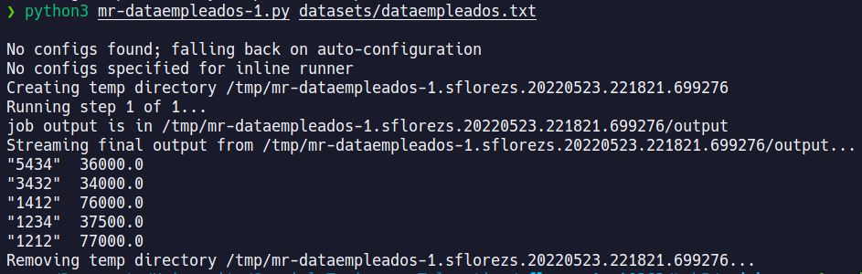

# Lab 5 STOT - ST0263
## Unit 3: Big Data
## AWS EMR

### Bucket
Public URL: https://sflorezs1datalake.s3.amazonaws.com/raw/datasets/  
Create a bucket with the default configuration.  

Upload datasets to `sflorezs1datalake`.  

### Cluster setup
- **Software configuration:**

- **Glue:**

- **Edit software settings:**

- **Cluster composition:**

- **Cluster Nodes and Instances:**

- **Cluster scaling:**

- **Auto-termination:**

- **EBS Root Volume:**

- **Security Options:**

- **Security Group for master:**

### HDFS
`ls`  

`ls /user`  

`upload dataset from s3`  

`ls /tmp/datasets`  

### HUE
Create datasets dir.  

Upload onu dataset.  

Data uploaded.  

Data open.

### MapReduce

Code can be found in the `./mrjob` directory.

- **Empleados:**
    - El salario promedio por Sector Económico (SE)  
    
    - El salario promedio por Empleado  
    
    - Número de SE por Empleado que ha tenido a lo largo de la estadística
    
- **Empresas:**
    - Por acción, dia-menor-valor, día-mayor-valor  
    
    - Listado de acciones que siempre han subido o se mantienen estables.  
    
    - DIA NEGRO: Saque el día en el que la mayor cantidad de acciones tienen el menor valor de acción (DESPLOME), suponga una inflación independiente del tiempo.  
    
- **Peliculas:**
    - Número de películas vista por un usuario, valor promedio de calificación  
    
    - Día en que más películas se han visto  
    
    - Día en que menos películas se han visto  
    
    - Número de usuarios que ven una misma película y el rating promedio  
    
    - Día en que peor evaluación en promedio han dado los usuarios  
    
    - Día en que mejor evaluación han dado los usuarios  
    
    - La mejor y peor película evaluada por genero  
    
