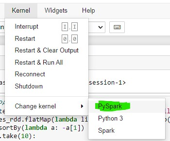
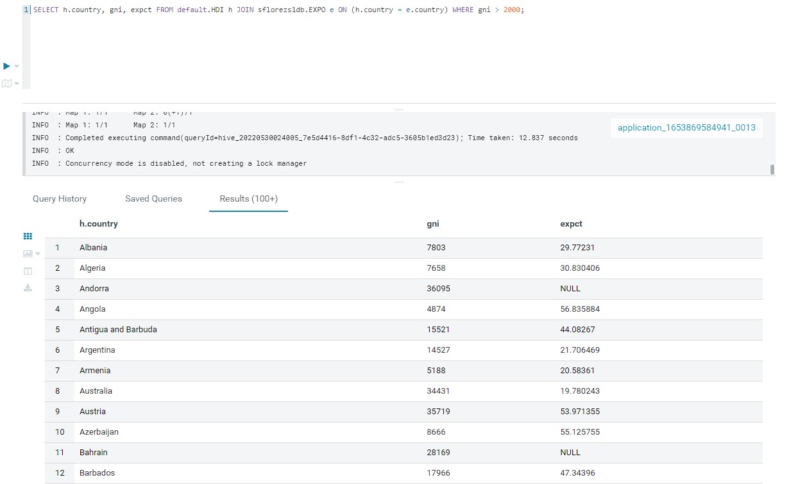
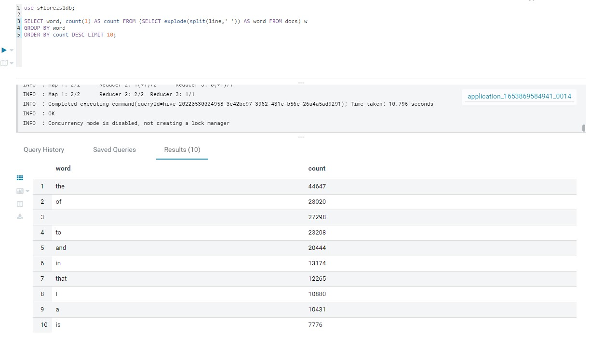

# Lab 6 STOT - ST0263
## Unit 3: Big Data
## AWS EMR
I will be using the same EMR config as in [Lab5](../Lab5/).

### PySpark CLI
Word count in PySpark CLI in master node:  

As you can see the two directories were created in `/tmp`:  

Submit a [file](./wc-pyspart.py) to PySpark  

### Zeppelin

Word count in Zeppelin:  

### JupyterHub

Upload [wordcount-spark.ipynb](./wordcount-spark.ipynb).  

Change kernel to `PySpark`:  

Run:  

### Hive

Create database, create table, store HDI data in table in hive directly.  

Show tables.  

Describe HDI table.  

Select data from said table.  

Select all countries that have a gni greater than 2000 and show their gni.  

Create new table for JOIN in external s3 storage.  

Join expo and hdi tables.  

### Word count in Hive

Using alternative 1.  

Sort by word.  

Sort by word descending.  

Insert the last result into another table.  

