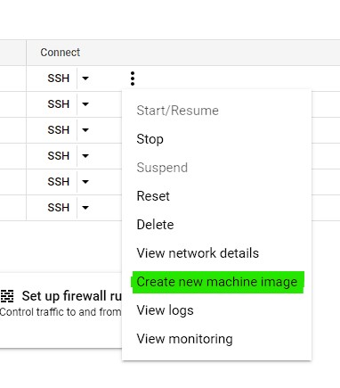

# Mongo databases

## Introduction
We'll be using a MongoDB Replica Set to enable replication. The lab proposes a two node Primary-Secondary (or Primary-Primary) schema, however it is not recommended to create a Replica Set with only two nodes, that's why we'll use a three node (Primary-Secondary-Secondary) schema. 

MongoDB will automatically balance even if the primary node fails and one of the secondary nodes will take its place. For more info on this: `https://www.mongodb.com/docs/manual/replication/`.

## Instructions
### Open ports
- Use the search bar and go into the firewall of your VPC.
- Create a new firewall rule.
    - Name it `mongo-db`
    - Set the target tags to: `mongodb`  
    
    - Enable incoming traffic for tcp port 27017  
    
    - Click create.

### Create base machine
- Create a new GCP Compute Engine Virtual Machine with the absolute minimum specs and set the network tags to `mongodb`. And name it: `mongodb-1`. **Use a Debian 10 image**.
- SSH into the machine and run:
    ```bash
    # if you haven't installed gnupg
    sudo apt-get install gnupg
    # import the gpg key from mongo
    wget -qO - https://www.mongodb.org/static/pgp/server-5.0.asc | sudo apt-key add -
    # add the repository for mongo
    echo "deb http://repo.mongodb.org/apt/debian buster/mongodb-org/5.0 main" | sudo tee /etc/apt/sources.list.d/mongodb-org-5.0.list
    # update package database
    sudo apt-get update
    # install db
    sudo apt-get install -y mongodb-org
    ```
- Run the database:
    ```bash
    systemctl enable mongod --now
    mongo
    ```
- Create an admin user:
    ```bash
    # inside the mongo shell
    use admin
    db.createUser(
        {
            user: "admin",
            pwd: "password",
            roles: [ "root" ]
        }
    )
    exit
    ```
- Create a keyfile. This will allow the nodes to talk without using a password. This will get shared when we create an image from this machine to create the other two.
    ```bash
    sudo sh -c "openssl rand -base64 756 > /etc/mongod-key"
    sudo chmod 400 /etc/mongod-key
    ```
- Create the configuration. This file enables replication, authentication and opens the db to the internet.  
    Put the following in `/etc/mongod.conf` with your favorite terminal text editor, don't forget to use `sudo`
    ```bash
    # mongod.conf

    # for documentation of all options, see:
    #   http://docs.mongodb.org/manual/reference/configuration-options/

    # Where and how to store data.
    storage:
    dbPath: /var/lib/mongodb
    journal:
        enabled: true
    #  engine:
    #  wiredTiger:

    # where to write logging data.
    systemLog:
    destination: file
    logAppend: true
    path: /var/log/mongodb/mongod.log

    # network interfaces
    net:
    port: 27017
    bindIp: 0.0.0.0


    # how the process runs
    processManagement:
    timeZoneInfo: /usr/share/zoneinfo

    security:
    authorization: "enabled"
    keyFile: /etc/mongod-key

    #operationProfiling:

    replication:
    replSetName: dev-rs0
    

    #sharding:

    ## Enterprise-Only Options:

    #auditLog:

    #snmp:
    ```
- Restart the mongod daemon.
    ```bash
    sudo systemctl restart mongod
    ```
- Test the mongo shell.
    ```bash
    mongo
    # in the mongo shell
    # try to run commands, it will show that you're not authorized
    ```
    ```bash
    mongo -u admin -p --
    # input your password
    # in the mongo shell
    # try to run any command
    ```
### Create an image
- Create an image based on the machine:  
      
      
    Name it `generic-mongodb-image`  
    Click `Create`  
      
- Wait for the image to create and hit the refresh button to check its status.
- Congrats! your image is now created. It'll help us in the creation of the other mongo machines.

### Create the other two nodes
- Create two new GCP Compute Engine Virtual Machines using the recently created `generic-mongodb-image`. Name them `mongodb-2` and `mongodb-3`

### Create the replication set
- Take note of the **internal IP** of the three nodes.
- SSH into the machine that will be the primary node and run:
    ```bash
    mongo -u admin -p --
    # in the mongo shell

    rs.initiate(
        { 
            _id: "dev-rs0",
            members: [
                {
                    _id: 0,
                    host: "<ip.of.primary.node>:27017"
                }, { 
                    _id: 1,
                    host: "<ip.of.secondary-1.node>:27017"
                }, {
                    _id: 2,
                    host: "<ip.of.secondary-2.node>:27017"
                }
            ]
        }
    )

    use bookstore
    db.createUser(
        {
            user: "bookmaster",
            pwd: "password",
            roles: [
                {
                    role: "root",
                    db: "bookstore"
                }
            ]
        }
    )
    db.createCollection("books")
    ```
- Test the cluster with:
    ```bash
    use bookstore
    db.runCommand({hello: 1})
    ```  
    It should return a long JSON with info about the cluster.
- Create the default data:
    ```bash
    use bookstore
    db.books.insert([
        {
            name: "Leonardo Davinci: La Biografia",
            image: "/images/img-ld-labiografia.jpeg",
            author: "Walter Issacson",
            description: "Basándose en las miles de páginas de los cuadernos manuscritos de Leonardo y nuevos descubrimientos sobre su vida y su obra, Walter Isaacson teje una narración que conecta el arte de Da Vinci con sus investigaciones científicas, y nos muestra cómo el genio del hombre más visionario de la historia nació de habilidades que todos poseemos y podemos estimular, tales como la curiosidad incansable, la observación cuidadosa y la imaginación juguetona. Su creatividad, como la de todo gran innovador, resultó de la intersección entre la tecnología y las humanidades. Despellejó y estudió el rostro de numerosos cadáveres, dibujó los músculos que configuran el movimiento de los labios y pintó la sonrisa más enigmática de la historia, la de la Mona Lisa. Exploró las leyes de la óptica, demostró como la luz incidía en la córnea y logró producir esa ilusión de profundidad en la Última cena.",
            countInStock: "2",
            price: "$50.000.oo"
        },
        {
            name: "Inteligencia Genial",
            image: "/images/img-ld-inteligenciagenial.jpeg",
            author: "Michael Gelb",
            description: "El que, para muchos, ha sido el mayor genio de todos los tiempos, Leonardo da Vinci, puede servir de inspiración a todo aquel que quiera desarrollar al máximo su potencial intelectual y su creatividad. Paso a paso, mediante ejercicios, técnicas y lecciones, este libro muestra el camino para ampliar los horizontes de la mente",
            countInStock: "3",
            price: "$30.000.oo"
        }
    ])
    ```