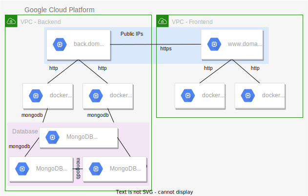
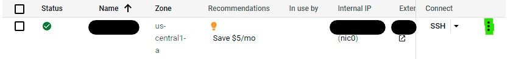
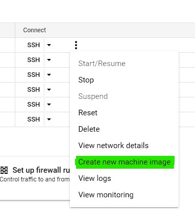

# Lab 2 Unit 2 STOT

## Introduction

We'll deploy a high availability version of a bookstore application, we are using infrastructure scaling and the application is mostly monolithic. 



As you can see, we need 9 VMs, GCP imposes a limit on the number of machines that can be created per project (that being 8, we are a machine short :c). If you see the diagram, the front and the back are separated in different VPCs, since they don't need an internal connection anyways, we'll be using two projects.

To save a little time we are going to be using some images, the three mongo machines are basically identical and we only need to config one an clone it two times. For the six docker machines we'll create a base docker machine and clone it. 

**Note:** These instructions assume that you know how to use DockerHub and have a setup already. Including two repos named: `bookstore-backend` and `bookstore-frontend`. This will accelerate the process of deployment and decrease the amount of dependencies in the machines.
## Instructions

### Base Image Creation
- Create a new GCP Compute Engine Virtual Machine with the absolute minimum specs and allow HTTP and HTTPs traffic. And name it: `generic-docker`. **Use a Debian 10 image**.
- SSH into the machine.
- Run:  
    **Note:** If the instructions below fail, you may use these: `https://docs.docker.com/engine/install/debian/`.
    ```bash
    # update system
    sudo apt-get update
    # install deps
    sudo apt-get install \
        ca-certificates \
        curl \
        gnupg \
        lsb-release
    # download and add Docker's official GPG key
    curl -fsSL https://download.docker.com/linux/debian/gpg | sudo gpg --dearmor -o /usr/share/keyrings/docker-archive-keyring.gpg
    # add docker's repository to the APT registry
    echo "deb [arch=$(dpkg --print-architecture) signed-by=/usr/share/keyrings/docker-archive-keyring.gpg] https://download.docker.com/linux/debian $(lsb_release -cs) stable" | sudo tee /etc/apt/sources.list.d/docker.list > /dev/null
    # install docker engine
    sudo apt-get update
    sudo apt-get install docker-ce docker-ce-cli containerd.io
    # enable and start docker service
    sudo systemctl enable docker --now
    # allow user to use docker without root
    USER=$(whoami)
    sudo usermod -G docker $USER
    ```
- Logout by closing the SSH session and SSH again into the machine.
- Test the docker installation:
    ```bash
    docker run hello-world
    ```
- Create an image based on the machine:  
      
      
    Name it `generic-docker-image`  
    Click `Create`  
      
- Wait for the image to create and hit the refresh button to check its status.
- Congrats! your image is now created. It'll help us in the creation of the other front and back-end machines.

    